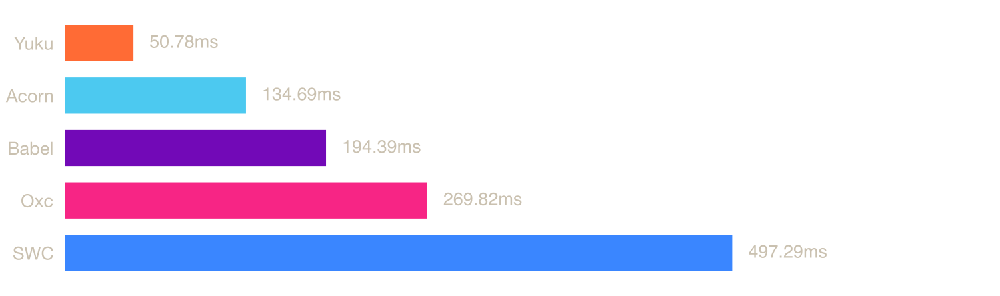
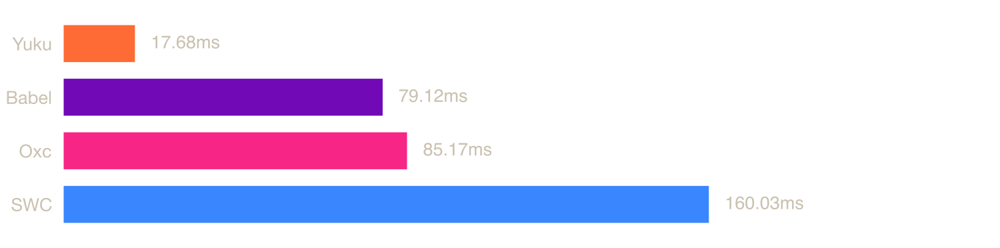
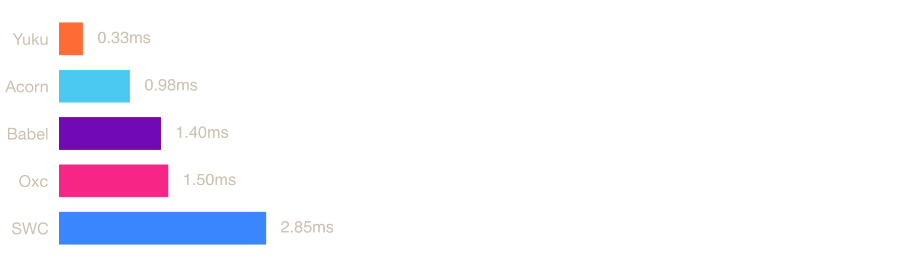

# ECMAScript Parser Benchmark (npm)

Benchmarks for ECMAScript parsers available as npm packages, including pure JavaScript parsers and native parsers (Zig, Rust) via NAPI bindings.

## System

| Property | Value |
|----------|-------|
| OS | macOS 23.1.0 (arm64) |
| CPU | Apple M3 Max |
| Cores | 14 |
| Memory | 36 GB |

## Parsers

### [Acorn](https://github.com/acornjs/acorn)

A tiny, fast JavaScript parser, written completely in JavaScript.

### [Babel](https://github.com/babel/babel/tree/main/packages/babel-parser)

A JavaScript compiler and parser used by the Babel toolchain.

### [Oxc](https://github.com/oxc-project/oxc)

A high-performance JavaScript and TypeScript parser written in Rust.

### [SWC](https://github.com/swc-project/swc)

An extensible Rust-based platform for compiling and bundling JavaScript and TypeScript.

### [Yuku](https://github.com/yuku-toolchain/yuku)

A high-performance & spec-compliant JavaScript/TypeScript compiler written in Zig.

## Benchmarks

### [typescript.js](https://raw.githubusercontent.com/yuku-toolchain/parser-benchmark-files/refs/heads/main/typescript.js)

**File size:** 7.83 MB



| Parser | Mean | Min | Max | Ops/sec | Relative |
|--------|------|-----|-----|---------|----------|
| **Yuku** | **74.65 ms** | **59.67 ms** | **122.68 ms** | **13.40 ops/s** | **baseline** |
| Oxc | 76.55 ms | 55.20 ms | 584.25 ms | 13.06 ops/s | 1.03× slower |
| Acorn | 204.48 ms | 192.26 ms | 232.11 ms | 4.89 ops/s | 2.74× slower |
| Babel | 221.04 ms | 204.55 ms | 315.08 ms | 4.52 ops/s | 2.96× slower |
| SWC | 769.75 ms | 621.64 ms | 1499.31 ms | 1.30 ops/s | 10.31× slower |

### [checker.ts](https://raw.githubusercontent.com/yuku-toolchain/parser-benchmark-files/refs/heads/main/checker.ts)

**File size:** 2.95 MB



| Parser | Mean | Min | Max | Ops/sec | Relative |
|--------|------|-----|-----|---------|----------|
| **Oxc** | **25.26 ms** | **20.67 ms** | **52.77 ms** | **39.58 ops/s** | **baseline** |
| Yuku | 29.25 ms | 24.33 ms | 61.56 ms | 34.19 ops/s | 1.16× slower |
| Babel | 75.76 ms | 68.80 ms | 87.94 ms | 13.20 ops/s | 3.00× slower |
| SWC | 202.07 ms | 190.07 ms | 245.68 ms | 4.95 ops/s | 8.00× slower |
| Acorn | Failed to parse | - | - | - | - |

### [react.js](https://raw.githubusercontent.com/yuku-toolchain/parser-benchmark-files/refs/heads/main/react.js)

**File size:** 0.07 MB



| Parser | Mean | Min | Max | Ops/sec | Relative |
|--------|------|-----|-----|---------|----------|
| **Yuku** | **0.45 ms** | **0.37 ms** | **5.51 ms** | **2245.55 ops/s** | **baseline** |
| Oxc | 0.49 ms | 0.31 ms | 30.44 ms | 2027.78 ops/s | 1.11× slower |
| Babel | 1.03 ms | 0.95 ms | 1.83 ms | 971.94 ops/s | 2.31× slower |
| Acorn | 1.27 ms | 1.21 ms | 7.81 ms | 784.54 ops/s | 2.86× slower |
| SWC | 3.97 ms | 3.73 ms | 6.78 ms | 251.77 ops/s | 8.92× slower |

## Run Benchmarks

### Prerequisites

- [Node.js 22.18 or later](https://nodejs.org/) - JavaScript runtime

### Steps

1. Clone the repository:

```bash
git clone https://github.com/yuku-toolchain/ecmascript-parser-benchmark-js.git
cd ecmascript-parser-benchmark-js
```

2. Install dependencies:

```bash
npm install
```

3. Run benchmarks:

```bash
npm run bench
```

This will run benchmarks on all test files. Results are saved to the `result/` directory.

## Methodology

Each parser is benchmarked using [Tinybench](https://github.com/tinylibs/tinybench) with warmup iterations followed by multiple timed runs. Each run measures the time to parse the source text into an AST. Source files are read from disk once and kept in memory for all iterations.

Native parsers (Oxc, SWC, Yuku) run through their respective NAPI bindings, so measured time includes the binding overhead. Pure JS parsers (Acorn, Babel) run directly in the JavaScript runtime.

### Oxc raw transfer

By default, `oxc-parser` serializes the AST to a JSON string in Rust and parses that string when JavaScript accesses the `program` property. This benchmark enables `experimentalRawTransfer`, which writes the Rust AST into a raw buffer and uses a generated JavaScript deserializer to construct the final AST directly. It avoids JSON serialization, the intermediate string, and `JSON.parse`, but still includes JavaScript object construction in the measured time.

For this benchmark, raw transfer requires Node.js 22.18 or later on a 64-bit, little-endian platform. The benchmark checks support before starting and fails with an explicit error on unsupported platforms.

The implementation reserves a 6 GiB `ArrayBuffer` to obtain a 2 GiB block aligned on a 4 GiB boundary. On systems with virtual memory, this reserves address space rather than consuming 6 GiB of physical memory. These benchmarks call `parseSync` sequentially, allowing Oxc to reuse a cached buffer; concurrent parsing can reserve multiple buffers and therefore requires substantially more virtual address space.

The benchmark accesses `program` for every parser so that results include obtaining the complete AST. Consequently, the Oxc numbers represent the experimental raw-transfer path and should not be interpreted as the performance of `oxc-parser` with its default options.

**Why is Yuku fast?** Yuku's AST is designed from the ground up to be transfer-friendly: flat, compact, and near-binary. Instead of serializing to JSON and parsing it back, the AST produced by the Zig parser can be passed to JavaScript with minimal conversion. Zig's comptime makes this safe by design. There are no multi-gigabyte allocations, only the memory the source being parsed actually needs.