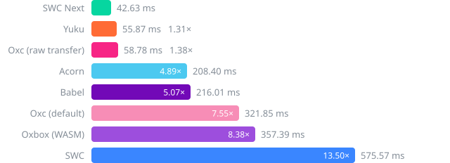
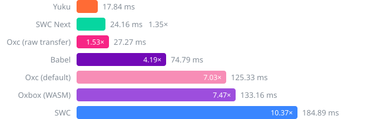
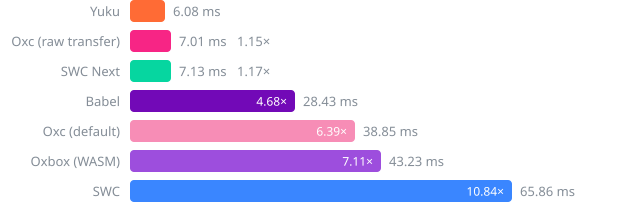
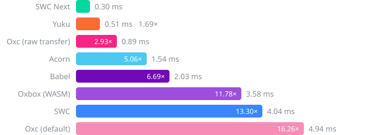

# ECMAScript Parser Benchmark (npm)

Benchmarks for ECMAScript parsers available as npm packages, including pure JavaScript parsers, native parsers (Zig, Rust) via NAPI bindings, and WebAssembly parsers.

## System

| Property | Value |
|----------|-------|
| OS | macOS 27.0.0 (arm64) |
| CPU | Apple M3 Max |
| Cores | 14 |
| Memory | 36 GB |

## Parsers

### [Acorn](https://github.com/acornjs/acorn)

A tiny, fast JavaScript parser, written completely in JavaScript.

### [Babel](https://github.com/babel/babel/tree/main/packages/babel-parser)

A JavaScript compiler and parser used by the Babel toolchain.

### [Oxc (raw transfer)](https://github.com/oxc-project/oxc)

The native Oxc parser with experimental raw AST transfer enabled.

### [Oxc (default)](https://github.com/oxc-project/oxc)

The native Oxc parser with its default AST transfer path.

### [Oxbox (WASM)](https://github.com/unjs/oxbox)

Oxc's parser packaged as a portable WebAssembly module.

### [SWC](https://github.com/swc-project/swc)

An extensible Rust-based platform for compiling and bundling JavaScript and TypeScript.

### [SWC Next](https://github.com/swc-project/swc-next)

A Rust rewrite of SWC with a flat, ESTree-based AST, using @swc-next/parser.

### [Yuku](https://github.com/yuku-toolchain/yuku)

A high-performance & spec-compliant JavaScript/TypeScript compiler written in Zig.

## Benchmarks

### [typescript.js](https://raw.githubusercontent.com/yuku-toolchain/parser-benchmark-files/refs/heads/main/typescript.js)

**File size:** 7.83 MB

**Configuration:** 3 runs, 1000 ms per run, 250 ms warmup.



| Parser | Median | RME | Mean | Min | Max | Ops/sec | Relative |
|--------|--------|-----|------|-----|-----|---------|----------|
| **SWC Next** | **42.63 ms** | **±7.46%** | **53.10 ms** | **38.70 ms** | **80.52 ms** | **23.46 ops/s** | **baseline** |
| Yuku | 55.87 ms | ±5.20% | 62.86 ms | 49.38 ms | 92.03 ms | 17.90 ops/s | 1.31× slower |
| Oxc (raw transfer) | 58.78 ms | ±4.86% | 59.69 ms | 44.97 ms | 106.93 ms | 17.01 ops/s | 1.38× slower |
| Acorn | 208.40 ms | ±1.32% | 211.53 ms | 196.29 ms | 251.12 ms | 4.80 ops/s | 4.89× slower |
| Babel | 216.01 ms | ±1.71% | 221.63 ms | 203.00 ms | 294.95 ms | 4.63 ops/s | 5.07× slower |
| Oxc (default) | 321.85 ms | ±1.79% | 329.69 ms | 306.46 ms | 384.37 ms | 3.11 ops/s | 7.55× slower |
| Oxbox (WASM) | 357.39 ms | ±0.13% | 357.79 ms | 350.70 ms | 371.99 ms | 2.80 ops/s | 8.38× slower |
| SWC | 575.57 ms | ±0.76% | 580.33 ms | 555.32 ms | 646.53 ms | 1.74 ops/s | 13.50× slower |

### [checker.ts](https://raw.githubusercontent.com/yuku-toolchain/parser-benchmark-files/refs/heads/main/checker.ts)

**File size:** 2.95 MB

**Configuration:** 3 runs, 1000 ms per run, 250 ms warmup.



| Parser | Median | RME | Mean | Min | Max | Ops/sec | Relative |
|--------|--------|-----|------|-----|-----|---------|----------|
| **Yuku** | **17.84 ms** | **±4.80%** | **19.84 ms** | **15.65 ms** | **49.18 ms** | **56.06 ops/s** | **baseline** |
| SWC Next | 24.16 ms | ±9.11% | 27.90 ms | 17.41 ms | 55.70 ms | 41.39 ops/s | 1.35× slower |
| Oxc (raw transfer) | 27.27 ms | ±8.22% | 32.57 ms | 21.12 ms | 97.77 ms | 36.68 ops/s | 1.53× slower |
| Babel | 74.79 ms | ±1.71% | 74.89 ms | 68.31 ms | 96.74 ms | 13.37 ops/s | 4.19× slower |
| Oxc (default) | 125.33 ms | ±7.21% | 138.23 ms | 102.17 ms | 298.14 ms | 7.98 ops/s | 7.03× slower |
| Oxbox (WASM) | 133.16 ms | ±4.89% | 139.50 ms | 112.59 ms | 380.57 ms | 7.51 ops/s | 7.47× slower |
| SWC | 184.89 ms | ±7.79% | 230.79 ms | 164.84 ms | 587.86 ms | 5.41 ops/s | 10.37× slower |
| Acorn | Failed to parse | - | - | - | - | - | - |

### [lib.dom.d.ts](https://raw.githubusercontent.com/yuku-toolchain/parser-benchmark-files/refs/heads/main/lib.dom.d.ts)

**File size:** 2.24 MB

**Configuration:** 3 runs, 1000 ms per run, 250 ms warmup.



| Parser | Median | RME | Mean | Min | Max | Ops/sec | Relative |
|--------|--------|-----|------|-----|-----|---------|----------|
| **Yuku** | **7.26 ms** | **±2.73%** | **7.55 ms** | **6.42 ms** | **14.29 ms** | **137.68 ops/s** | **baseline** |
| SWC Next | 8.00 ms | ±1.53% | 8.22 ms | 7.18 ms | 10.53 ms | 124.97 ops/s | 1.10× slower |
| Oxc (raw transfer) | 10.45 ms | ±7.42% | 10.82 ms | 7.39 ms | 62.04 ms | 95.66 ops/s | 1.44× slower |
| Babel | 30.89 ms | ±1.96% | 31.44 ms | 27.26 ms | 52.22 ms | 32.38 ops/s | 4.25× slower |
| Oxc (default) | 52.63 ms | ±8.95% | 69.75 ms | 39.61 ms | 179.41 ms | 19.00 ops/s | 7.25× slower |
| SWC | 68.76 ms | ±6.80% | 76.39 ms | 67.13 ms | 256.07 ms | 14.54 ops/s | 9.47× slower |
| Oxbox (WASM) | 74.52 ms | ±5.30% | 75.50 ms | 43.77 ms | 121.06 ms | 13.42 ops/s | 10.26× slower |
| Acorn | Failed to parse | - | - | - | - | - | - |

### [react.js](https://raw.githubusercontent.com/yuku-toolchain/parser-benchmark-files/refs/heads/main/react.js)

**File size:** 0.07 MB

**Configuration:** 3 runs, 1000 ms per run, 250 ms warmup.



| Parser | Median | RME | Mean | Min | Max | Ops/sec | Relative |
|--------|--------|-----|------|-----|-----|---------|----------|
| **SWC Next** | **0.30 ms** | **±3.62%** | **0.44 ms** | **0.24 ms** | **6.45 ms** | **3293.08 ops/s** | **baseline** |
| Yuku | 0.51 ms | ±0.97% | 0.57 ms | 0.34 ms | 7.52 ms | 1943.16 ops/s | 1.69× slower |
| Oxc (raw transfer) | 0.89 ms | ±14.40% | 1.46 ms | 0.40 ms | 44.46 ms | 1124.10 ops/s | 2.93× slower |
| Acorn | 1.54 ms | ±2.84% | 1.73 ms | 1.23 ms | 22.45 ms | 650.95 ops/s | 5.06× slower |
| Babel | 2.03 ms | ±6.07% | 2.45 ms | 1.33 ms | 16.59 ms | 492.39 ops/s | 6.69× slower |
| Oxbox (WASM) | 3.58 ms | ±9.72% | 5.19 ms | 2.17 ms | 36.52 ms | 279.64 ops/s | 11.78× slower |
| SWC | 4.04 ms | ±4.91% | 5.14 ms | 3.32 ms | 14.52 ms | 247.51 ops/s | 13.30× slower |
| Oxc (default) | 4.94 ms | ±8.90% | 5.94 ms | 2.67 ms | 52.80 ms | 202.58 ops/s | 16.26× slower |

## Run Benchmarks

### Prerequisites

- [Node.js 22.18 or later](https://nodejs.org/) - JavaScript runtime
- [pnpm 11.17.0](https://pnpm.io/) - Package manager

### Steps

1. Clone the repository:

```bash
git clone https://github.com/oxc-project/bench-javascript-parser.git
cd bench-javascript-parser
```

2. Install dependencies:

```bash
pnpm install
```

3. Run benchmarks:

```bash
pnpm run bench
```

This downloads or updates the benchmark files and runs all benchmarks. Results are saved to the `result/` directory. Use `pnpm run load-files` to update the files separately, or `pnpm run bench:lib_dom` to benchmark only `lib.dom.d.ts` after downloading the files.

Benchmark duration is configurable via `BENCH_TIME` (timed duration per run in ms, default 10000), `BENCH_WARMUP` (warmup duration in ms, default 2000), and `BENCH_RUNS` (independent runs per parser, default 3). Tinybench also enforces minimum sample counts, so slower parsers can exceed these durations. Run on AC power with other applications closed for more stable results.

## Methodology

Each parser is benchmarked using [Tinybench](https://github.com/tinylibs/tinybench) with warmup iterations followed by multiple timed runs. Each run measures the time to parse the source text into an AST. Source files are read from disk once and kept in memory for all iterations.

Every parser × file combination runs in a fresh process for each independent run, so JIT state and GC pressure from one parser do not carry over to another. Each combination is benchmarked in multiple independent runs (3 by default), and the reported median is the median of the run medians. Mean and RME are also medians across runs; min and max are the extremes across all runs. The RME column shows the relative margin of error of the mean at 95% confidence within a run; it does not measure uncertainty in the reported median or variability between runs.

Native parsers (Oxc, SWC, SWC Next, Yuku) run through their respective NAPI bindings, so measured time includes the binding overhead. Oxbox runs through WebAssembly. Pure JS parsers (Acorn, Babel) run directly in the JavaScript runtime.

`lib.dom.d.ts` is a global declaration script. Babel uses declaration mode, and SWC parses it as a script to support its `...arguments` parameter names.

### Oxc raw transfer

By default, `oxc-parser` serializes the AST to a JSON string in Rust and parses that string when JavaScript accesses the `program` property. The Oxc (raw transfer) benchmark enables `experimentalRawTransfer`, which writes the Rust AST into a raw buffer and uses a generated JavaScript deserializer to construct the final AST directly. It avoids JSON serialization, the intermediate string, and `JSON.parse`, but still includes JavaScript object construction in the measured time.

For this benchmark, raw transfer requires Node.js 22.18 or later on a 64-bit, little-endian platform. The benchmark checks support before starting and fails with an explicit error on unsupported platforms.

The implementation reserves a 6 GiB `ArrayBuffer` to obtain a 2 GiB block aligned on a 4 GiB boundary. On systems with virtual memory, this reserves address space rather than consuming 6 GiB of physical memory. These benchmarks call `parseSync` sequentially, allowing Oxc to reuse a cached buffer; concurrent parsing can reserve multiple buffers and therefore requires substantially more virtual address space.

The benchmark accesses each parser's AST (`program` or `body`) on every iteration so that results include obtaining the complete AST. The Oxc (raw transfer) and Oxc (default) rows show both AST transfer paths. Oxbox 0.1.0 bundles Oxc 0.151.0; the native Oxc version is recorded in `pnpm-lock.yaml`.

**Why is Yuku fast?** Yuku's AST is designed from the ground up to be transfer-friendly: flat, compact, and near-binary. Instead of serializing to JSON and parsing it back, the AST produced by the Zig parser can be passed to JavaScript with minimal conversion. Zig's comptime makes this safe by design. There are no multi-gigabyte allocations, only the memory the source being parsed actually needs.